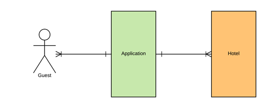
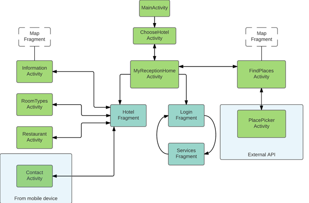
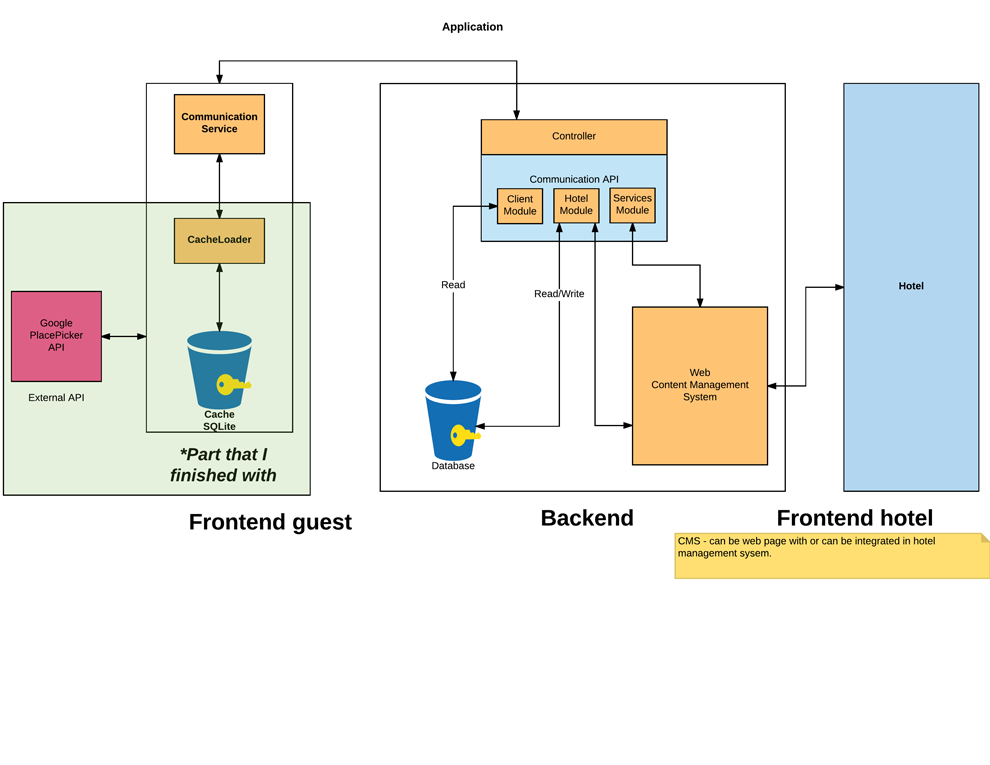

# Delivery for exam task 
PG4600-1 17V Mobil utvikling

### Task:
Open task, make android application for hotel reception.

### Requirements
1. Check-in, check-out: information from persisted source
2. Fragment architecture
3. External API
4. Map
5. Database (internal or REST)
6. Async calls

### Solution
Main idea was to provide hotel reception service remotely for hotels and guests.   
One backend system (potentially [firebase](https://firebase.google.com/) for development) and RESTapi as middleware.    
  

MyReception application. Prototype represents client-side app with internal Sqlite db as cache.
As external API used:  
[PlacePicker](https://developers.google.com/places/android-api/placepicker?hl=en) from 
[GooglePlaces API](https://developers.google.com/places/)

### Application flow

### Application diagram

### Video description
